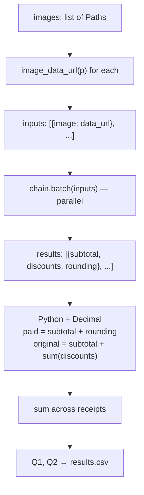

# FTEC5660 Homework 1: Receipt Chain

Build a LangChain pipeline that reads every supermarket receipt in a folder
with the vision-capable DeepSeek Flash model and answers these two questions:

1. How much money did I spend in total for these bills?
2. How much would I have had to pay without the discount?

For this homework, **amount spent** means the final payment after the receipt's
rounding line. **Without the discount** means the sum of the original positive
item prices: add back every promotion, coupon, member, app, packaging-damage,
and percentage discount, but do not add back rounding.

## Student task

Only edit the two functions in `hw1.py` that contain `### YOUR CODE HERE`:

- `build_chain()` creates your LangChain chain.
- `answer_queries()` runs the chain on the receipt images and returns one final
  response for each question.

You may use prompt chaining, routing, parallel calls, reflection, or a
combination. Your final responses should each contain one HKD amount. Do not
hard-code filenames or public answers; grading uses unseen receipt folders.

## Setup and public test

```bash
python3 -m venv .venv
source .venv/bin/activate
pip install -r requirements.txt
```

Put your DeepSeek key after `DEEPSEEK_API_KEY=` in `.env`, then run:

```bash
python3 hw1.py --image-folder public_test
```

The program creates `results.csv` in the current directory. Its columns are
`query`, `model_response`, and `correctness`. The public answers are in
`public_test/ground_truth.json`. The starter intentionally returns the dummy
response `please design your chain to answer these two queries.` so it runs
before you add any API code.

The required model is `deepseek-v4-flash-vision-exp`, the vision-capable
DeepSeek Flash model. JPEG, PNG, GIF, and WebP inputs are accepted by the
homework runner.


## Homework 1 solution: 
> to students: please fill your solution description here.
## Homework 1 solution

### Chain visualization



### Description

There are three things my solution does.

**Firstly**, build a chain. The chain takes `{image}` as input — this is the receipt picture, encoded as a data URL. The LLM (`deepseek-v4-flash-vision-exp`) reads the image and outputs one JSON object with three fields: `subtotal` (the 小計 line), `discounts` (a list of every discount amount as a positive number, not including rounding), and `rounding` (the ROUNDING line with its sign). I use `JsonOutputParser` so the output comes back as a Python dict directly.

**Secondly**, write code to read this dict and do the maths. All arithmetic is in Python, not in the model, using `Decimal` for accuracy. For each receipt:

```
paid     = subtotal + rounding
original = subtotal + sum(discounts)
```

Then I add up `paid` across all 7 receipts to get Q1, and add up `original` to get Q2.

**Thirdly**, format the answer. Each response must contain exactly one HKD amount, so I return `f"HK${total:.2f}"` — for example `"HK$1974.30"`.

One thing I learned: at first I asked the model to output the two totals directly. Q1 was correct (the paid amount is printed on the receipt so the model just copies it), but Q2 was off by HK$114.79 — the model dropped discount lines when trying to read and add at the same time. Adding "scan line by line" to the prompt helped a bit (error dropped to HK$28.20) but did not fix it. Moving all the arithmetic to Python and letting the model only output raw fields solved it completely. Both answers are now exact on the public test.
